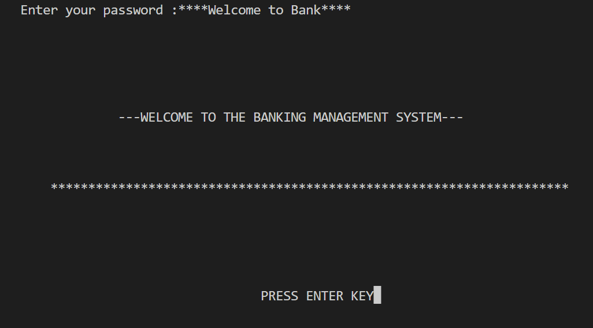
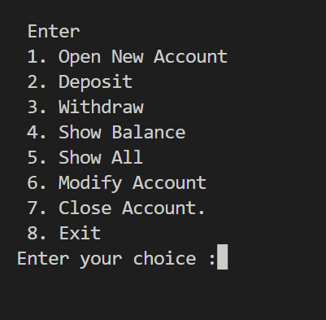
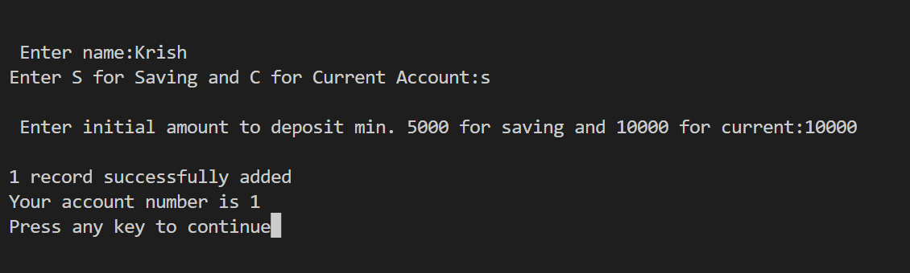
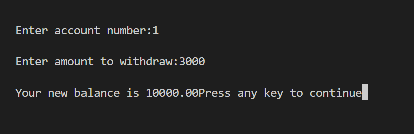
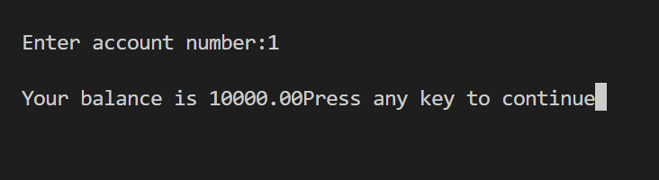
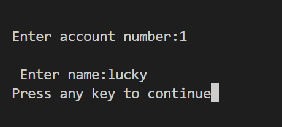
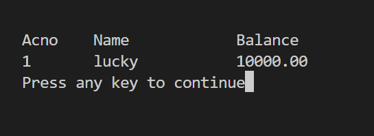
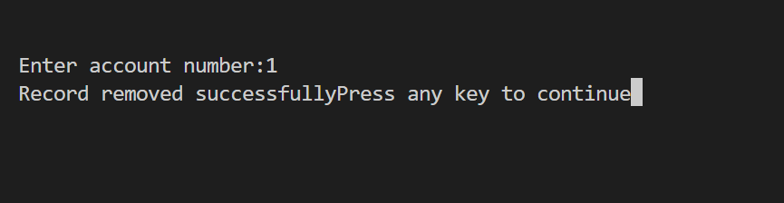

# Bank Management System
 * Bank management system project is a c programming based mini project. It has a command-line interface. It is useful for managing a bank account in a bank.

* Bank management system  is useful for managing bank account in a bank. It is a very useful software for maintaining account’s record. Although it has command line interface it is very easy to use and implement. The project performs CRUD operations without errors.

* **It is password protected. The password to enter this system is “bank” (all with lower case).** 
* Hence, this project is just like real banking software with all basic features. 

* It doesn’t consist of high graphics.

* It is the simple one and users can understand very easily.

## Execution Flow of the Program
## 1. Welcome Text
   When we execute the project code and after entering the above mentioned "Password" we will see some welcome text on screen.

   

## 2. Functions that can be Performed
   * We must press the enter key to get started. As we click the enter button we will reach the main menu screen. 
   * From this screen, we will be able to use the function of the system. 
   * The main menu has eight options.

   
   
## 3. Open New Account
   * The options are open new account, deposit, withdraw, show balance, account holder’s list, modify an account, close account and exit. 
   * We must enter the number for selecting the options.
   * Select 1 to create new account. 
   * We need to fill some information. Such as account no, account holder name, account type (current or saving), and balance.
   **Account created !!**

   
   
   ## 4. Deposit Money
   * The deposit option allows you to deposit money in your account. 

   
   
   ## 5. Withdraw Money
   * Withdraw option allows you to take out money from your account. 
   * You must provide the account number to withdraw. 

   
   
    
   ## 6. Show Balance
   * The show balance shows current balance of the account.
   * You must provide the account number. 

   
   
   ## 7. Show All Accounts
   * The show all displays all the people’s account information stored . 

   
   
   ## 8. Modify Account
   * Further, you can modify your account if you get your wrong information.

    
   
   * After modification , details of accounts are :- 

     
     
     ## 9. Close Account
   * You can also close an account or delete account.

   
   
   ## 10. Exit
    
   * After you finish your task you can easily exit from the system.  

This is how the system works. 
It is easy to understand the project code too. 
It uses bin file to store the information.
Using this, we can easily create account and store the information.
File handling is used to store the information.

# All Done!!

